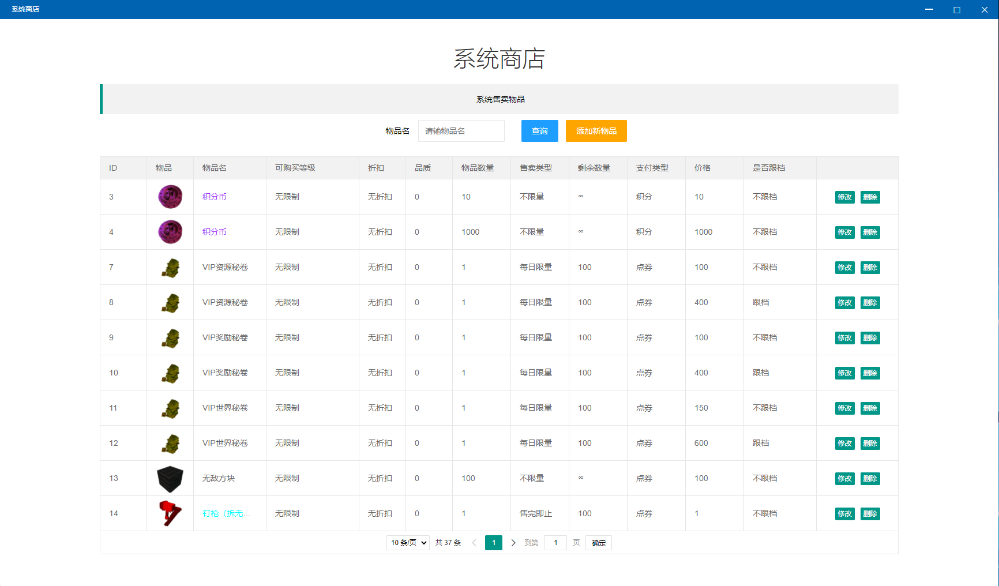
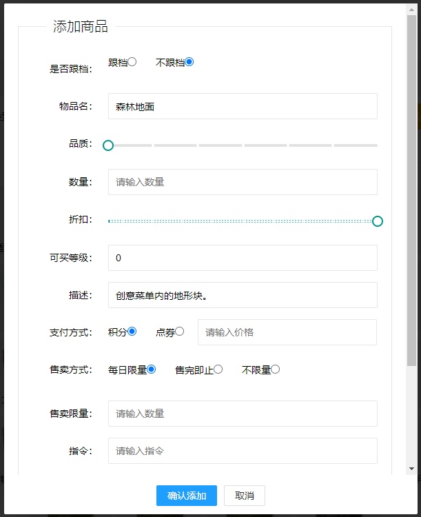

# 系统商店

界面系统商店如上图所示，提供通过物品名查询功能

* **添加新物品，点击此按钮会进入物品选择界面如图在此界面可选择需要售卖的物品，可以通过物品名和物品类型搜索物品**
* 找到物品后点击物品图片出现以下界面此界面可以对商品进行配置

1.是否跟档，选择是，在交易系统进行清理时可以选择保留并重置跟档道具，实现道具的夸存档继承**（前提是此物品在新档中仍可以使用）**

2.物品名，此项由系统自动填写无需修改

3.品质，此项可以设置物品的品质，若物品本身没有品质则此项设置无效

4.数量，发放的物品数量

5.折扣，折扣范围从0~10，设置好系统将自动计算最后售价

6.可购买登记，够买等级限制，如100表示用户达到100级才可以够买，-100表示玩家超过100级就无法够买，0表示无限制

7.描述，展示在玩家的购买界面

8.支付方式，可选积分和点券，后面的框是具体数量

9.售卖方式，每日限量（每天限售数量，每日0点更新） 售完即止（字面意思） 不限量（字面意思）

10.售卖数量，当售卖方式设置为每日限量、售完即止，可通过此项配置具体限量数

11.指令：此项可配置玩家购买物品提取到游戏中时执行的指令，可用此实现自动反作弊加白名单操作

* 修改按钮点击进入修改物品界面，修改界面和添加界面类似，配置含义也一样
* 删除按钮可以删除当前物品

