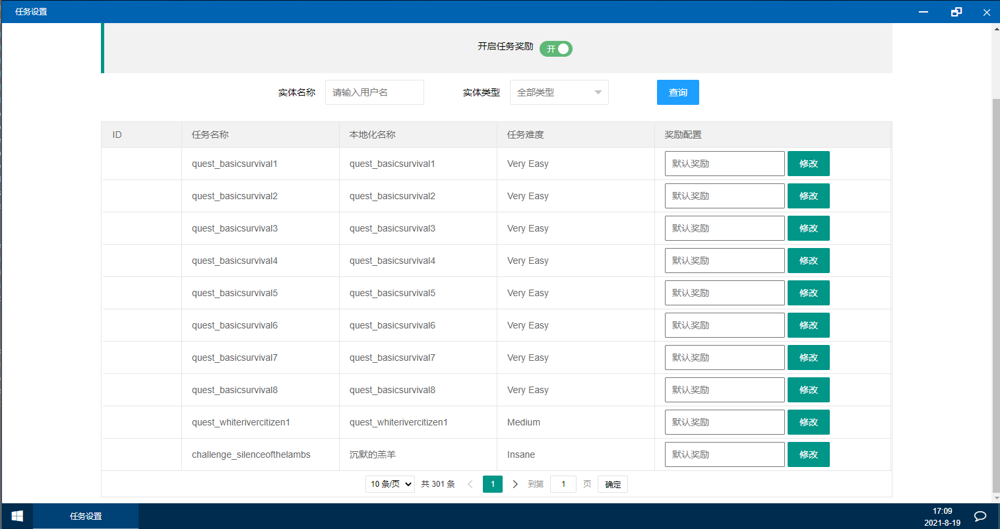

# 任务设置

任务配置如上图所示，此功能提供玩家完成任务奖励

1. 开启任务奖  字面意思
2. 可用名称、类型进行查询
3. 奖励配置   此项应输入整数，如果不输入或输入空值系统将使用[.env文件配置](../.env-pei-zhi-wen-jian-xiang-jie.md)进行奖励发放
4. 修改方法为：在你想要修改的选项对应输入框内输入整数，然后点击修改按钮


例如，开启任务奖励，设置【ER搜刮任务】奖励为100积分

则玩家完成【ER搜刮任务】过的100积分，完成其他任务使用[.env配置文件](../.env-pei-zhi-wen-jian-xiang-jie.md)数据进行发放



请注意！完成任务积分到账会有30左右的延迟，如果使用了Naiwazi ServerKit，有可能任务奖励会失效，或者在用户退出重新进入服务器后才会发放，主要原因是pdf更新是有周期的


