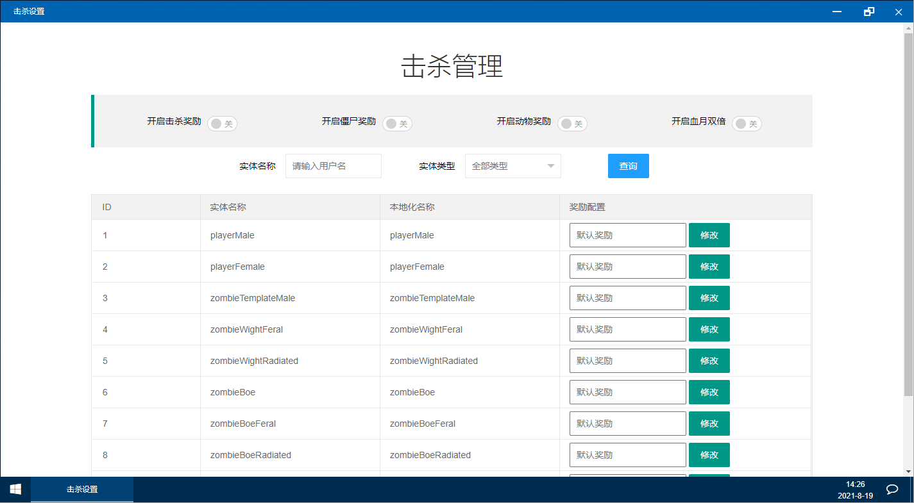

# 击杀设置

击杀设置如上图所示，此功能提供玩家击杀实体后的积分奖励配置

> 请注意，如果你同时使用了NaiwaziBot，建议关闭本系统击杀奖励，或者关闭NaiwaziBot、开启本系统，否则会两边都发放

1.开启击杀奖励，开打此开关开启击杀奖励

2.开启僵尸奖励，字面意思

3.开启动物奖励，字面意思

4.开启血月双倍，打开此开关玩家在血月会获得双倍积分

5.奖励配置 此项应输入整数，如果不输入或输入空值系统将使用[.env文件配置](../.env-pei-zhi-wen-jian-xiang-jie.md)进行奖励发放


例如，开启击杀奖励，开启僵尸奖励，开启动物奖励，开启血月双倍，然后修改雪地僵尸的奖励为100，修改鸡的奖励为200。则实际执行情况如下

* 玩家平时击杀雪地僵尸奖励100积分，击杀其他敌对生物奖励[.env文件配置](../.env-pei-zhi-wen-jian-xiang-jie.md)的默认积分数
* 玩家平时击杀鸡奖励200积分，击杀其他动物奖励.env文件配置的默认积分数
* 血月击杀奖励在平时的基础上\*2，血月击杀雪地僵尸获得200积分，击杀鸡获得400积分，其他未配置实体，发放积分量为在[.env文件配置](../.env-pei-zhi-wen-jian-xiang-jie.md)基础上\*2


