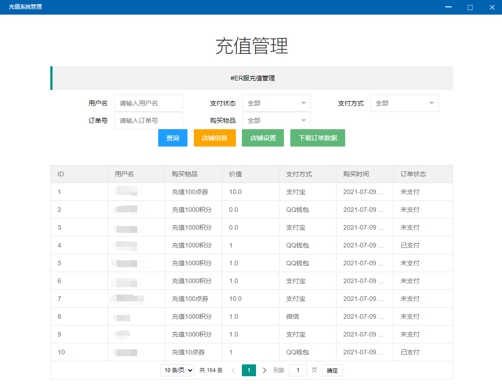
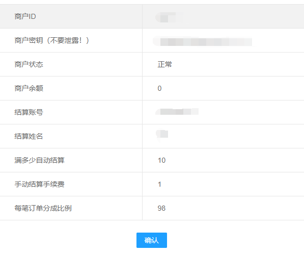
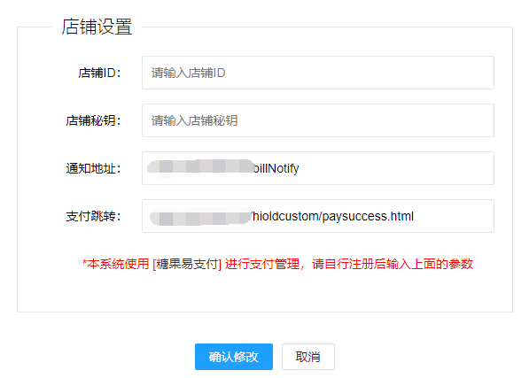

# 充值系统管理


敏感功能免责声明：此功能需要你自行注册【糖果易支付】平台账号，进行订单管理，资金管理，分成也由平台获得。你使本功能总成的一切损失、后果，与本系统开发者无关。开发者不负任何法律责任。


## 店铺信息

* 店铺信息界面显示内容为您自行注册的 【**糖果易支付】** 店铺信息
  * 商铺ID：对应糖果易支付**商户ID**
  * 店铺秘钥：对应糖果易支付的 **商户KEY**
  * 商户状态：一般都是正常，除非有玩家举报订单，可能造成封禁，请自行联系平台处理
  * 商户余额：当天收入，此平台一天结算一次
  * 结算账号：你在糖果易支付设置的收款支付宝账号
  * 结算姓名：与结算账号对应
  * 满多少结算：当天收入超过此值，会自动结算，第二天收到支付宝转账
  * 结算手续费：字面意思
  * 每笔订单分成比例：这个是代理商用的，如果你不是代理商，请忽略

## 设置店铺

* 店铺设置：用于设置糖果易支付平台参数，设置好这些参数，用户才能正常充值
  * 店铺ID：输入【糖果易支付】平台的商户ID
  * 店铺秘钥：输入【糖果易支付】平台的商户KEY
  * 通知地址：自动填充
  * 支付跳转：自动填充

## 下载订单数据

* 本程序提供订单下载功能，你可以通过此功能下载表格，整理充值数据、对账等等

