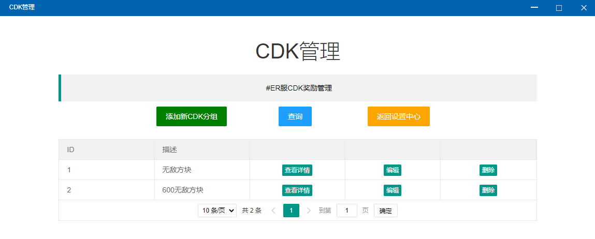
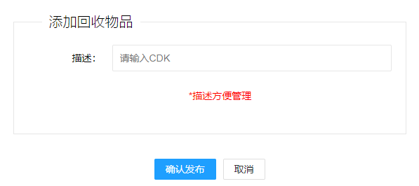
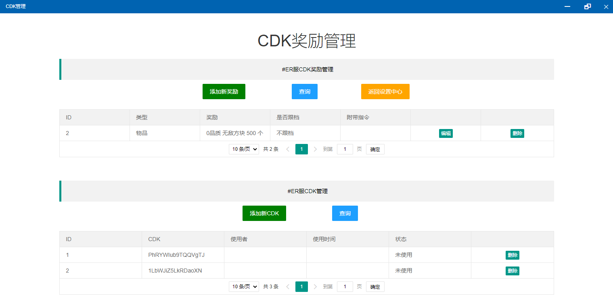
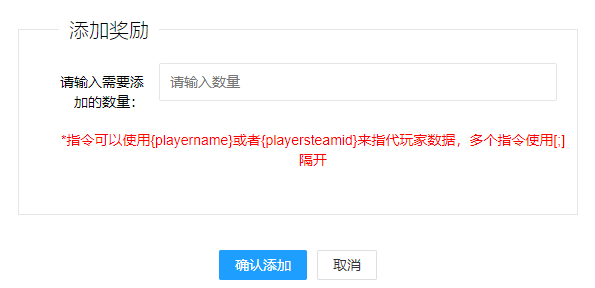

# CDK管理

## 添加新CDK

* 描述仅用于管理员自己识别，没有实际作用

## 查看详情（CDK配置）


CDK管理分为两个部分，奖品配置、CDK兑换码配置


### 奖励配置

* 添加新奖励（与前面的功能类似，不再赘述）
* 编辑
* 删除

### CDK兑换码配置

* 添加新CDK

数量：此数量表示的是生成出的CDK数量。例如输入10，点击添加，系统会自动生成10个CDK，可以兑换此CDK奖励。

* 删除（字面意思）


例如添加一个CDK组，然后在此CDK组中添加一个奖励1000积分，然后再打开添加CDK，输入10，点击确认添加。

那么，系统会生成10个CDK，可以兑换1000积分，你可以把这些CDK发给玩家，玩家在玩家端可以使用CDK兑换功能，使用该CDK


