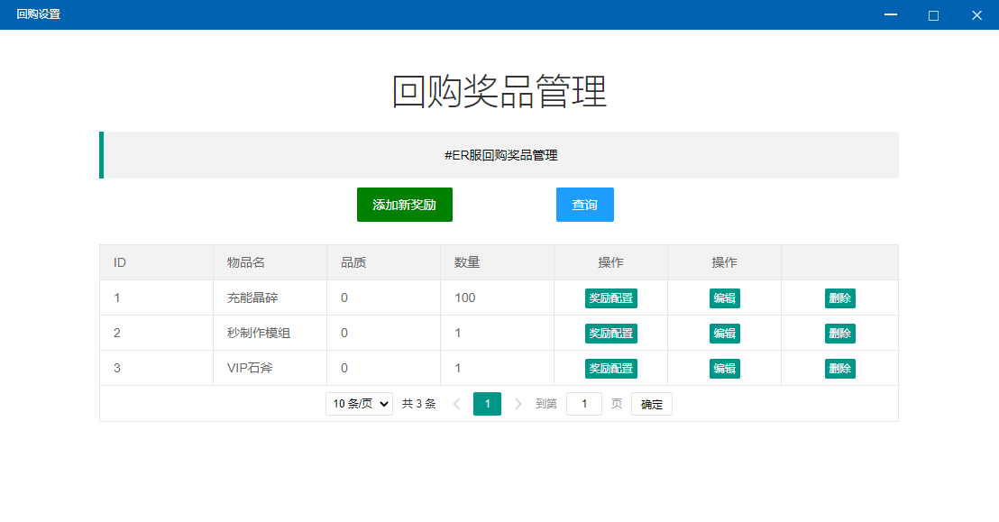
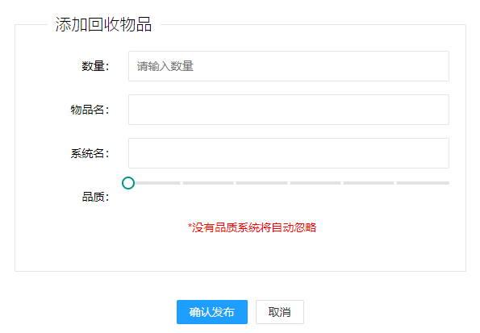

# 回购设置

## 添加新奖励

* 数量：单次回购的数量
* 物品名：回购的物品名
* 系统名：系统物品名称
* 品质：物品品质

## 列表

* 奖励配置：与前面几个功能类似，不再赘述
* 编辑：点击打开编辑界面
* 删除：删除当前回购


例如配置一个回购数量1，物品名【VIP兑换券】，系统名【VIPdhq】，品质0，在配置一个奖励1000积分。

那么在玩家端会出现一个回购，玩家使用该回购，系统将从玩家仓库扣除一个【VIP兑换券】，然后发放1000积分给玩家


