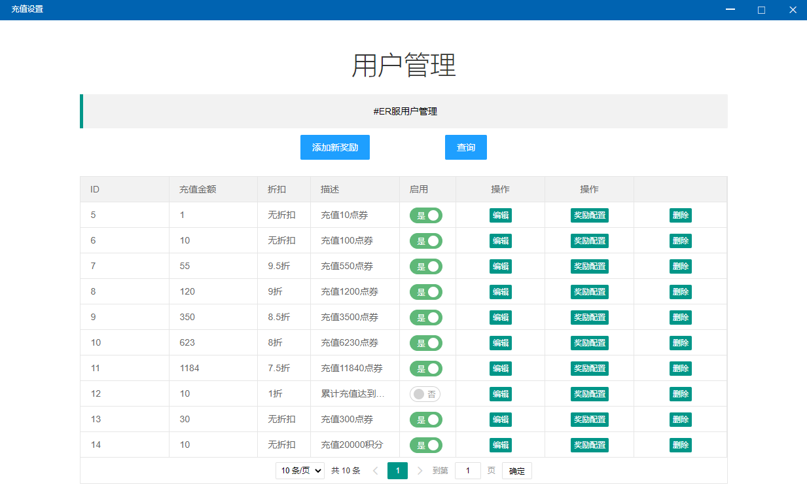
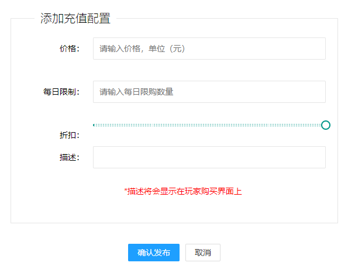
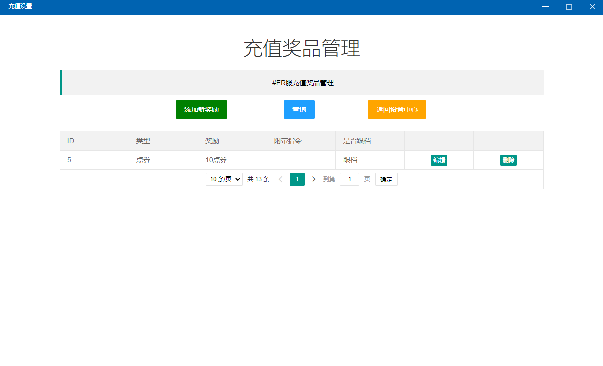
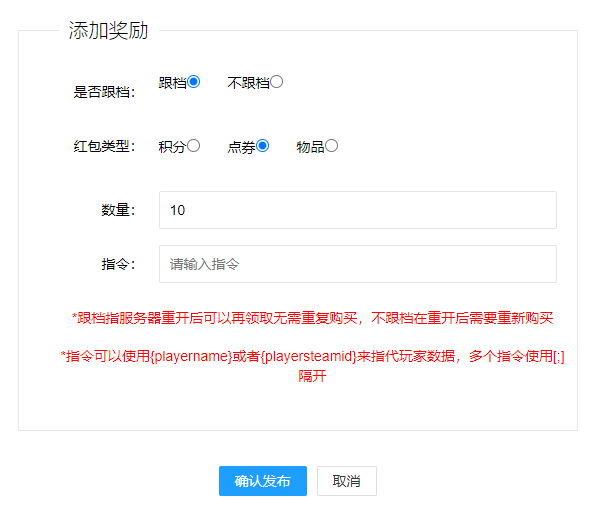

# 充值设置


请注意！此功能需要在 [【充值系统管理】](untitled-2.md) 功能中配置好[【糖果易支付】](https://pay.tgyzf.cn/)，否则本功能无效


## 添加新充值

* 价格：售价
* 每日限制：每日允许用户购买的次数
* 折扣：折扣，系统将自动计算售价的折扣后价格
* 描述：显示给玩家看的信息

## 列表

* 启用按钮：是否启用此重启，不启用玩家无法进行支付
* 编辑：点击打开窗口，修改充值信息
* 奖励配置：点击打开奖励配置界面

* 添加新奖励
  * 是否跟档：是否跨存档继承
  * 红包类型：红包奖励种类
  * 数量：奖励数量
  * 指令：购买提取后执行的指令，可用于配置白名单
* 删除：删除对应数据


例如配置一个充值：价格100，每日限制2，折扣9，描述 【VIP礼包】，然后给这个礼包配置两个奖励：【100点券】、【VIP石斧】\*1

则玩家可以在用户端的充值模块中看到 【VIP礼包】这个充值选项，实际售价为90元，玩家可以使用微信、支付宝、财付通三种方式进行支付，支付完成之后，系统将自动为玩家发放100点券和【VIP石斧】一把


