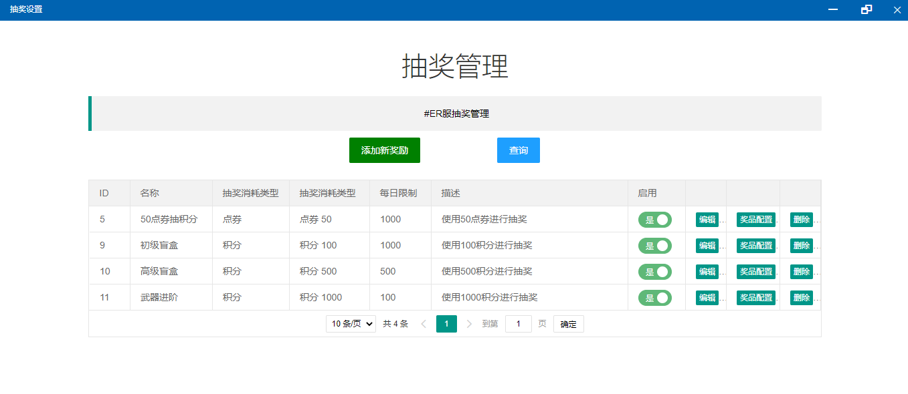
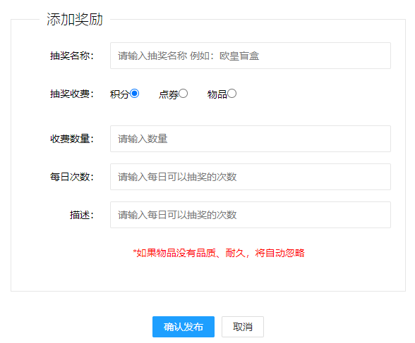
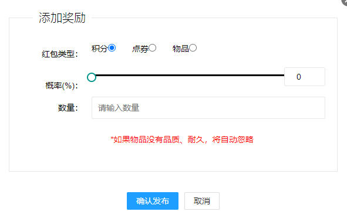

# 抽奖设置

## 主界面

* 新增奖励按钮：打开新增抽奖包页面
* 查询按钮：查询所有抽奖包数据
* 抽奖包列表
  * 启用开关：是否启用对应抽奖包，选择是 玩家才可以抽奖
  * 编辑按钮：打开编辑界面
  * 奖品配置按钮：打开奖品配置界面
  * 删除按钮：删除对应抽奖包

## 添加新奖励

* 抽奖名称：显示在用户端的奖池名称
* 抽奖收费
  * 积分：使用积分进行抽奖
  * 点券：使用点券进行抽奖
  * 物品：使用物品进行抽奖（游戏内存在的物品，比如mod新增的物品）
* 收费数量：配合抽奖收费，积分点券为扣除数量，物品为扣除个数
* 每日次数：每天每个用户允许抽奖次数
* 描述：对此抽奖的描述，这个描述不会展示给用户，是方便管理员理解

## 奖品配置

* 红包类型
  * 积分：抽中发放积分
  * 点券：抽中发放点券
  * 物品：抽中发放物品
* 概率
  * 概率可以是从0~10000的任意值，用这个值÷100，获得的值就是概率
* 数量
  * 抽中发放的具体奖励数量


请注意！奖励多可以添加11种，超过11种系统将不在受理新的奖励

抽奖出货的总概率为100%，例如：你配置的各种奖励出货概率相加为90%，那么剩下的10%系统将自动将其分配给 再接再厉 即未中奖。

如果你配置的物品未达到11种，但是概率达到100%，那么系统也不在受理新的奖励



这个例子就懒得写了，太长了


