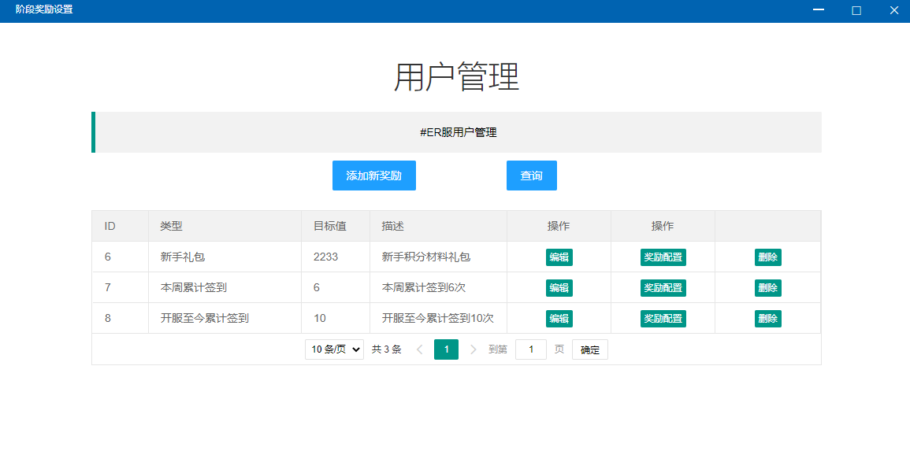
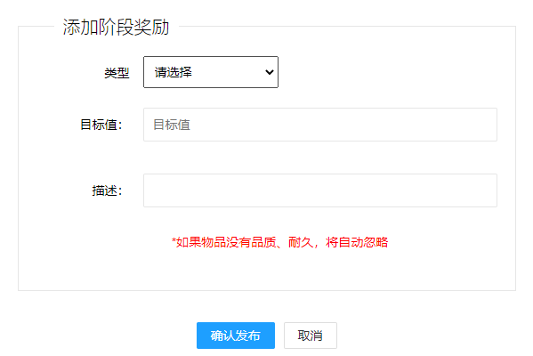
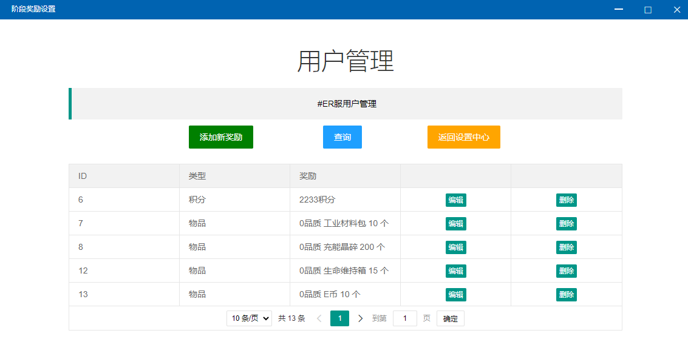
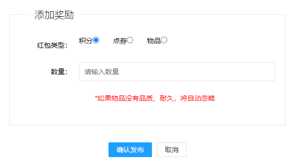

# 阶段奖励设置

## 添加新奖励

* 类型

> 可用的类型有如下几个

> * 累计在线时长：玩家在线游玩时长，单位为小时
> * 本周累计签到：从周一到周日，签到次数
> * 开服至今累计签到：累计签到
> * 游戏等级：游戏内玩家登记
> * 击杀僵尸数：玩家击杀僵尸数量
> * 新手礼包：在玩家账户初始化的时候自动发放


请注意！本系统的签到和NaiwaziBot的签到互不影响，在NaiwaziBot进行的签到本系统无法识别


* 目标值：用户达到这个值才可以领取奖励
* 描述：描述会显示在用户端，方便用户理解

## 奖励配置

* 添加新奖励

> * 红包类型：可选积分、点券、物品
> * 数量：发放的数量

* 编辑，删除：对当前奖励进行操作
* 查询：可用于刷新列表
* 返回设置中心：回到阶段配置


例如添加一个阶段奖励，累计签到3天获得奖励

则玩家在签到三天后，可以在玩家端领取奖励


