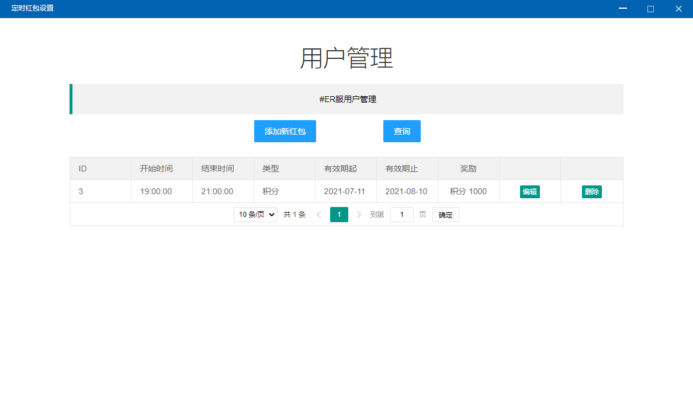
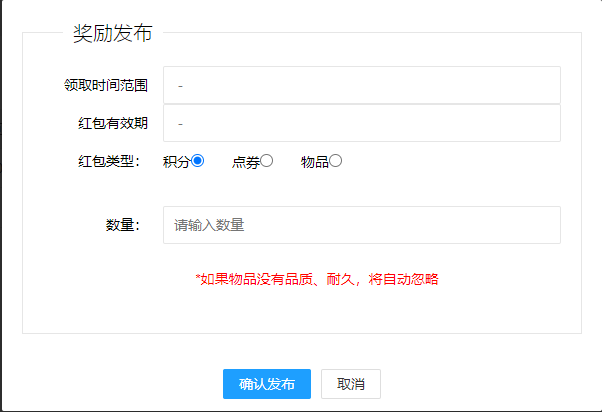

# 定时红包设置

## 添加新红包

* 领取时间范围：此红包每天可以领取的时间
* 红包有效期：此红包可领取的日期
* 红包类型：红包的种类
* 数量：奖励数量


例如添加一个红包，领取时间范围19:00:00 - 21:00:00，有效期2021-07-11 - 2021-08-10，红包类型积分，数量500

则玩家在2021年7月11日到2021年8月10日期间，每天的19:00:00~21:00:00，可以在网页端领取500积分，每天限制一次


