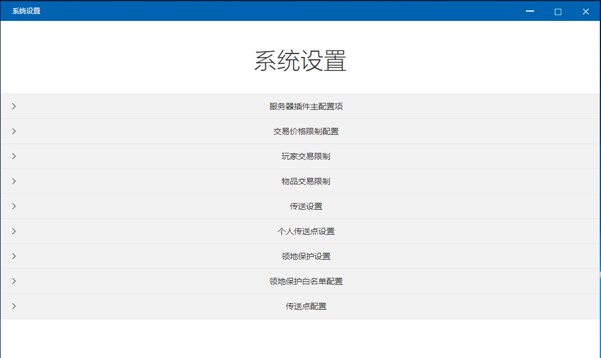

# 系统设置

## 服务器插件主配置项

* 是否开启交易：交易系统开关，此开关控制全系统是否启用
* 管理服务器：管理端地址
* 服务器秘钥：服务器通信秘钥
* 服务器端口：服务器插件服务端口

## 交易价格限制配置

* 此功能可以设置针对某个物品的价格限制（最高价、最低价）


例如：设置木头最低价2，最高价100，那么用户在进行拍卖操作的时候，只能将单价设置为2~100之内。


## 玩家交易限制

* 黑名单模式：在此列表内用户禁止使用交易系统
* 白名单模式：仅允许此列表内用户使用交易系统


例如将模式设置为黑名单，再添加一个用户hiold1，那么hiold1这个用户将无法使用交易系统


## 物品交易限制

* 黑名单模式：在此列表内物品禁止交易
* 白名单模式：仅允许在此列表内物品交易


例如将模式设置为黑名单模式，在添加一个物品 \[VIP石斧\] ，那么 \[VIP石斧\] 这个物品将无法交易


## 传送设置

* 是否开启传送：字面意思
* 传送命令：服务器响应传送命令
* 消耗积分：传送一次小号的积分量
* 积分时间：两次传送之间的间隔


例如开启传送，传送命令TP-，消耗积分50，冷却30

则玩家输入TP-目标玩家名，目标玩家会收到一个传送请求，目标玩家输入yes同意传送，玩家会被传送到目标玩家身边并扣除50积分，然后进入30秒的冷却，30秒内不能再发起传送


## 个人传送点设置

* 是否开启个人传送：字面意思
* 设置家命令：玩家设置个人传送点命令
* 回家命令：玩家回到个人传送点命令
* 消耗积分：消耗积分数量
* 最大数量：最大个人传送点数量


例如开启个人传送点，设置家命令szj，回家命令hj，消耗积分10，最大数量100

则玩家可以通过szj设置默认家，hj回到默认家并扣除10积分

玩家可以使用 szj jia2 设置一个名叫jia2的个人传送点，hj jia2 回到jia2个人传送点并扣除10积分

玩家可以通过 \[szj 传送点名称\] 设置最多100点


## 领地保护设置

* 是否开启领地保护：字面意思
* 领地保护命令：响应玩家的领地保护命令
* 好友间免PT：好友无视pt
* 检查周期：多少秒检查一次用户是否闯入领地
* 保护范围：领地范围，玩家进入这个范围会被传送走
* 踢出范围距离：闯入玩家传送距离


例如开启保护，命令pt，打开好友免pt，检查周期5，保护范围45，踢出范围45

则场景如下，领地是玩家a的，玩家b是玩家a的好友，玩家c是陌生人，玩家a输入pt开启领地保护，玩家b可以正常进出领地，玩家c在进入玩家a领地45米范围内，会在5秒内被传送到45米外


## 领地保护白名单配置

* 此功能可以配置免pt的玩家


例如添加一个用户hiold1，则hiold1这个用户可以正常进出所有人领地，不被领地保护传送走


## 传送点配置

* 此功能可以配置服务器公共传送点，供所有玩家使用


例如添加一个传送点，命令hc1，【传送坐标100,100,100】 ，传送点描述【回城1】，消耗积分10

则玩家可以输入hc1命令,传送到100,100,100这个点并扣除10积分


