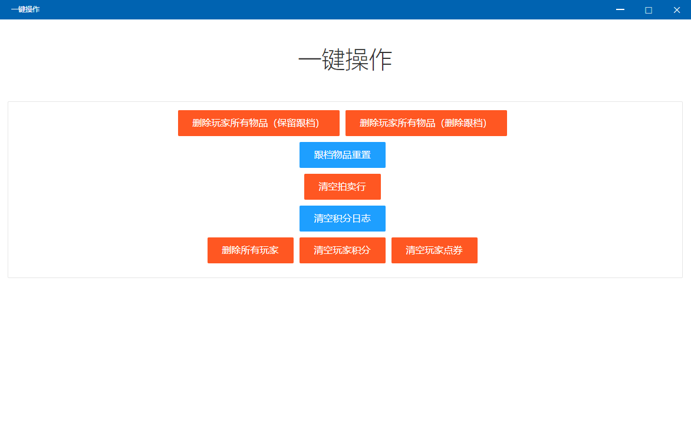

# 一键操作


请注意！本功能所有操作均不可逆！操作前请注意数据安全！


## 一键操作

* 删除玩家所有物品（保留跟档）：删除玩家的个人库存内普通物品，跟档物品不删除（跟档的意思去前面的功能找）
* 删除玩家所有物品（删除跟档）：删除玩家个人库存所有物品，包括跟档物品
* 跟档物品重置：跟档物品恢复，执行此操作玩家领取过的物品会重新出现，可以再领取一次
* 清空拍卖行：清空玩家拍卖物品
* 清空积分日志：清空积分数据
* 删除所有玩家：删除所有玩家数据
* 清空玩家积分：归零所有玩家积分（使用NaiwaziBot，请再NaiwaziBot清理积分，本功能无效）
* 清空玩家点券：归零所有玩家点券

