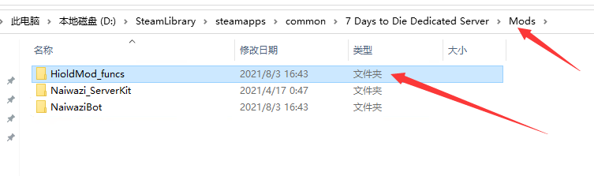
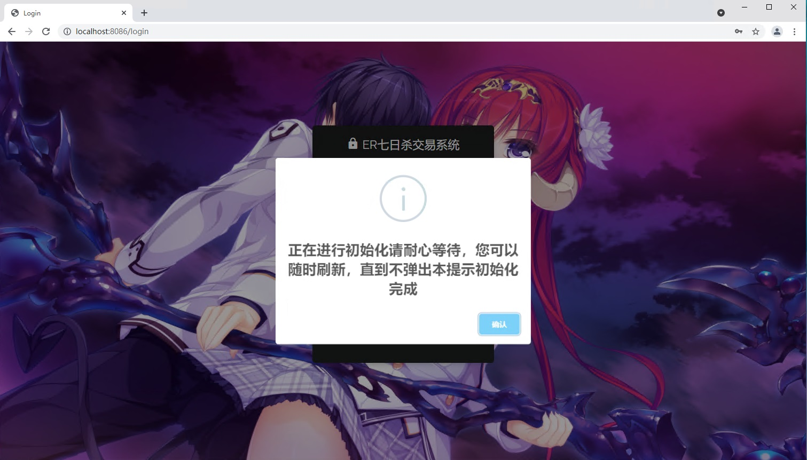

# 快速安装

* 到qq群中下载 `木屋海鸥交易系统.zip` 
* 将压缩包中文件解压到服务器的**Mods**中

* **重启服务器，等待服务器完全启动**（可以正常进入游戏），如果使用了**serverkit**，**重启GS**即可**无需重启网关**
* 使用chrome、qq浏览器、360浏览器（除了IE其他的都行） 打开页面[http://localhost:8086](http://localhost:8086) 进行配置


如果无法正常进入页面，请手动运行api文件夹下 **【启动.bat】** 文件


* 按照页面提示，继续进行后续配置


请注意！如果你不知道配置的含义，不建议修改，即使你懂也不要乱改，尤其是ip、端口，跟你理解的很有可能不是一个东西

再重复一边，看不懂不要改！看得懂也要慎重改

再重复一边，看不懂不要改！看得懂也要慎重改

再重复一边，看不懂不要改！看得懂也要慎重改


* 配置完成后，系统会进入初始化状态，可以刷新页面，直到不再出现提示窗口

* 系统初始化完成，使用管理员账号密码进行登录（如果你没有修改那么默认为账号：admin  密码：admin，请登录后立即修改密码）


至此系统已初始化完成，可以正常使用，具体用法情况后面的章节


